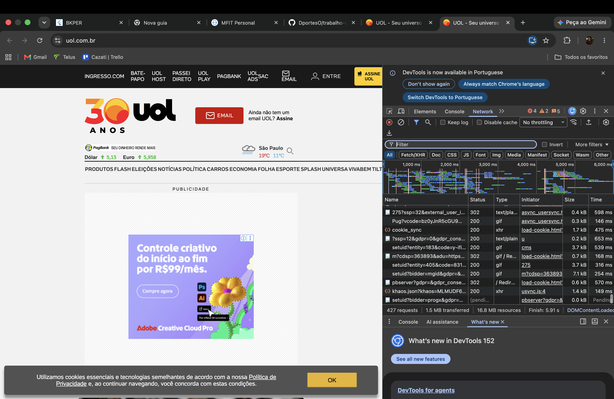

# Trabalho - Ambiente de trabalho com Git e GitHub (TI 1)

## Identificação

- **Nome:** Diego Leite Portes Caetano
- **Matrícula:** 933458

## Inspeção de conexão do navegador

Print da tela com os testes de inspeção de conexão (aba Rede/Network das ferramentas de desenvolvedor), mostrando a quantidade de arquivos necessários para montar a página de um portal.

## Resultado do index.html

Print da tela com a visualização da página `index.html` (Hello World).

